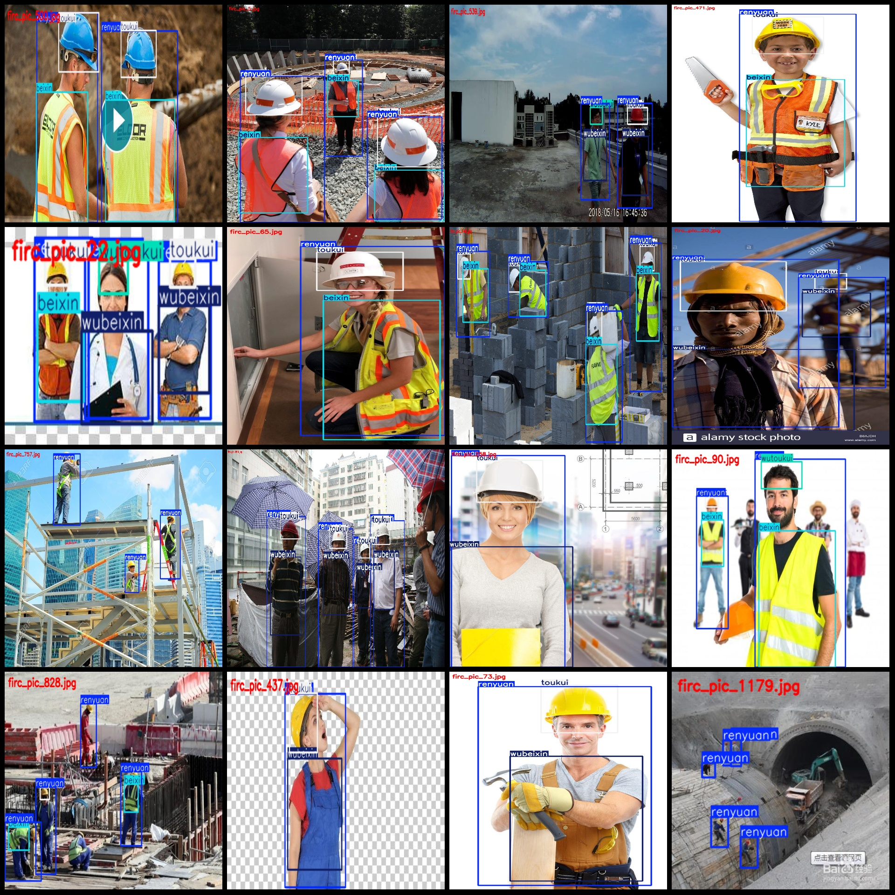
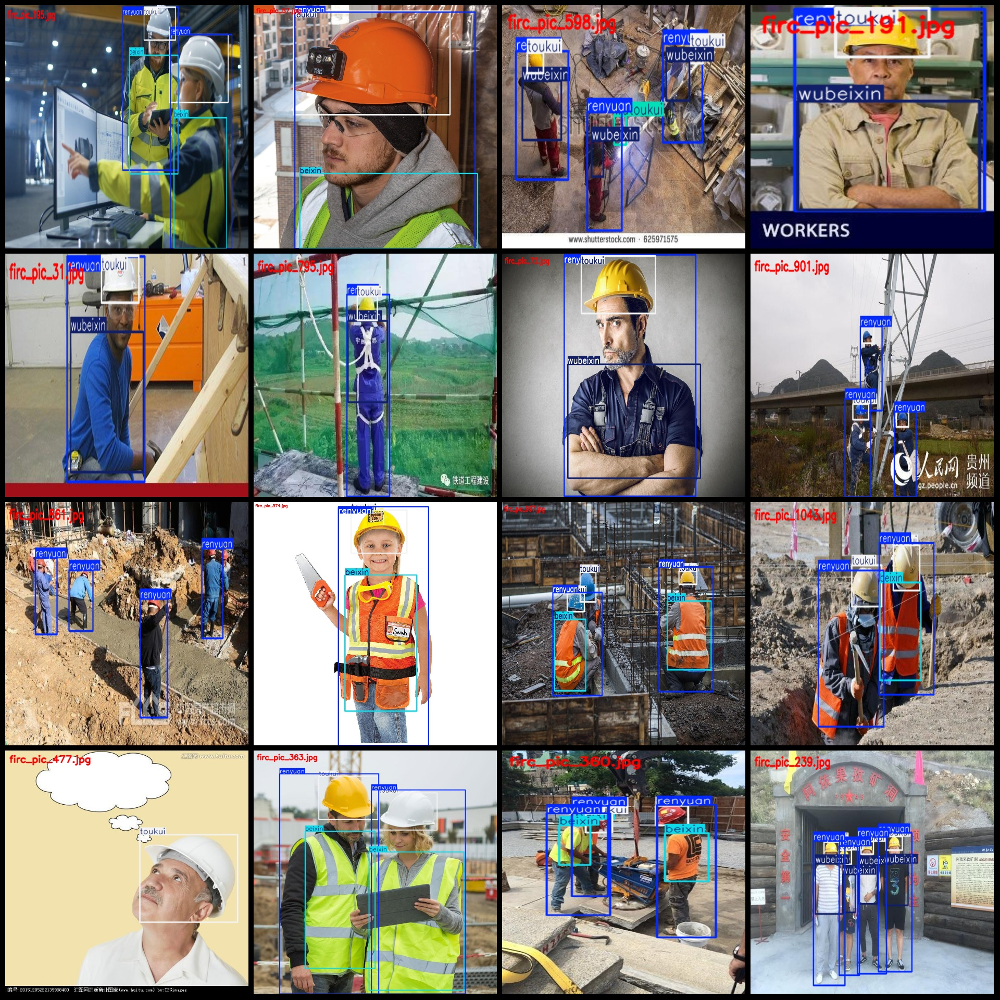

# Smart Construction Safety Helmet, Bodysuit, Mask, Reflective Clothing Data Set

Dataset format: Pascal VOC format + YOLO format (txt files without split paths, only containing JPG images and corresponding VOC format xml files and YOLO format txt files)
Number of images (JPG file count): 1206
Number of annotations (xml file count): 1206
Number of annotations (txt file count): 1206
Number of annotation categories: 5
Annotation category names (note that the order in YOLO format is different from this, and should be based on the labels folder's classes.txt): ["beixin", "renyuan", "toukui", "wubeixin", "wutoukui"]
Chinese category names corresponding to these annotations: ["bodysuit", "person", "helmet", "no-bodysuit", "no-helmet"]
Number of bounding boxes per category:
beixin bounding boxes = 1343
renyuan bounding boxes = 2817
toukui bounding boxes = 2543
wubeixin bounding boxes = 892
wutoukui bounding boxes = 129
Total bounding box count: 7724
Number of images per category:
beixin images = 635
renyuan images = 1189
toukui images = 1137
wubeixin images = 473
wutoukui images = 66
Image resolution: Images with multiple resolutions, such as 1024x682, 560x386, etc.
Annotation tool used: labelImg
Annotation rules: Draw bounding boxes for each category
Important note: The dataset does not have separate training, validation, or test sets; you will need to manually divide them.
Special declaration: This dataset does not guarantee any accuracy in the trained models or weight files.
Image previews:

## Images

Here is a pay link on Stripe ( https://buy.stripe.com/3cs8yP7sY87d0vu9AB ). Please contact me lonlonago@foxmail.com after funding $89, and I will send you a complete data files , thank you!

